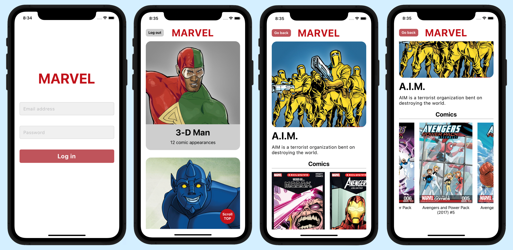

# **Marvel App**

Marvel App is a mobile app that serves as an interactive guide to the Marvel universe, where users can browse through heroes and the comics they appear on. It is built with **React Native** and **Typescript**.

## **Description**

The App consumes data from the Marvel API and shows a list of heroes as a home screen. The list displays 10 heroes per page with **endless-scroll**. The user can press on a hero to navigate to the **detail page**, where additional info will be displayed. The user will find a **list of the comics** where the hero appears, paginated with **endless-scroll**. In order to use the app, the user will have to log in.

## **Tech Stack**

- **React Native** v0.63
- **Typescript**
- **React Context**
- **Redux Toolkit**
- **Apisauce**
- **React Navigation**
- **Jest & React Native Testing Library**
- **ESLint & Prettier**
- Developing target: iOS

## **Getting started**

To start the project, first you need to install the dependencies with npm or yarn. Run the following command in the project root:

```
npm install // yarn install
```

Install the pods via Cocoapods:

```
cd ios
pod install
```

Once you have the dependecies installed, start Metro Bundler running the following command in the project root:

```
npm start // yarn install
```

Let the Metro Bundler run in its own terminal and open a new one inside the project. Run the following command:

```
npm run ios // yarn run ios
```

The default simulator device is "iPhone 11". If you wish to run the app on another device, use the **`--simulator`** flag, followed by the device name as a string. For example: **`npm run ios --simulator="iPhone 14"`**.

## **Running tests**

To run the test suite, use the following command:

```
npm test
```

## **Additional information and comments**

- Developed following **SOLID** and **Clean Code** principles.
- The app has been tested using **Jest** and **React Native Testing Library**, with a **test coverage up to ~70%**.
- The user will find an **intuitive user interface** that ensures a **seamless** and **accessible experience**. **Feedback** is given to the user via **loading states** and **error handling**. This has been achieved by **putting the user at the center** while developing the app.
- To handle API requests, the library Apisauce is used. Additionally, the app **caches** the API responses using a **proxy object**. This means that if a request with the same parameters is made again, the app will **retrieve** the **cached data** from the **proxy object** instead of making an actual API request. This helps to **improve performance and reduce the number of API calls**.
- The app has been developed using the **adapter pattern**. The components are designed to **contain minimal logic** and **receive data via props or hooks** that **encapsulate the logic**. This approach makes the components **easier to test** since the received props can be easily mocked, and function spies or specific states can be used to test the component behavior. **Refactors** are also easier to perform, as the **components** themselves **do not need to be changed**. Instead, you only need to modify the hook where the logic is encapsulated, giving you **greater confidence** in the **reliability of your tests**.

## **Screenshots**



Feedback to user via loading states and error handling:


